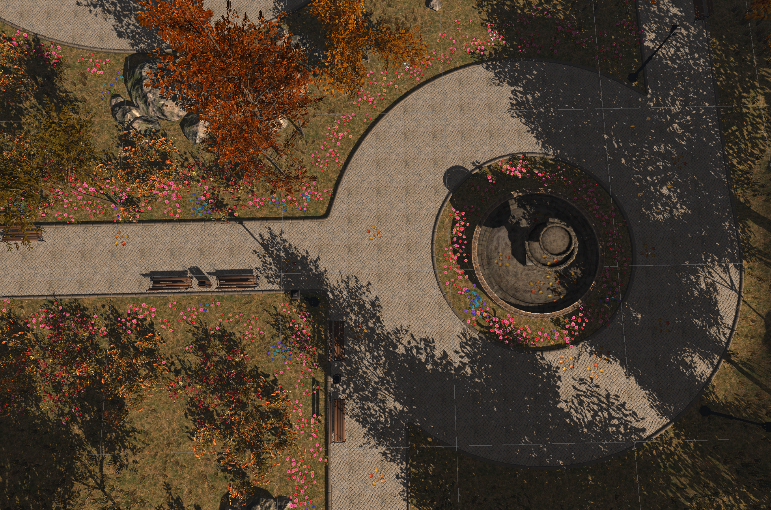

# VPS(VirtualPublicSpace) Research-EncounterBehaviors

A small project that explored the potential of virtual reality (VR) as a tool for studying public space design and understanding user behavior within pre-designed virtual public spaces. Typically for its preliminary and experimental nature, this research focuses on encounter and serendipitous interactions.

## Experiment Design

The experiment was designed to study social interactions in virtual public spaces, particularly focusing on "encounter" behavior akin to typical encounters in public parks. The Virtual Garden Party environment, modeled after a public park setting, served as the experimental space.

### Space Preset

The Virtual Garden Party was constructed in a realistic style, drawing inspiration from real-life public park settings, which are typical public space types. The environment featured a major encounter zone (fountain roundabout), three guiding spaces (park pathways), several interactable objects (fountain, park benches), and soft-restricted zones (grass lawns). While the space offered a degree of openness, air walls were positioned at the boundaries to define the activity area.

     
    
     

    Figure 1: Wireframe diagram of the Virtual Garden Party's interactive space, with dashed lines delineating the "Major Encounter Zone," green rectangles representing interactable objects in the environment, white indicating guiding spaces, and dark gray indicating soft-restricted zones.

     
    
     

     
    
     

    Figure 2: Virtual Garden Party Scene 2. 

### Procedures

Participants were spread into ***random*** area, instructed to spend 20 minutes in the Virtual Garden Party, engaging in natural social interactions without specific tasks or guidance. Prior to the experiment, they were informed that it was a virtual reality interaction party, and no specific task were granted other than attempting to interact with other participants. Participants can use the microphone to communicate with other participants directly, but the conversations are not one-on-one; instead, they can be heard by others in the environment, ***simulating public conversation***.

### Avatar

Throughout the experiment, participants used ***realistic-style*** avatars provided by the researchers and were free to select their preferred avatar from the available options. The participants' avatars can interact with interactable objects in the scene but cannot interact with other avatars.

## Data Collection

Experimenters closely observed participants' ***distribution*** and ***activities*** throughout the space, providing qualitative insights into their navigation and engagement patterns. 

Following the experiment, participants underwent interviews to gather qualitative feedback on their experience, impressions of the space, and social interactions, with special attention given to note-worthy interactions. 

Group interviews were conducted to collectively discuss these interactions. As part of the post-experiment assessment, participants completed the Social Interaction Anxiety Scale (SIAS) , providing additional insights into their levels of discomfort or anxiety related to social interactions within the virtual environment.

***Details, data and results will be published in HCII 2024 in late Aug. 2024.***
